

<h2 align="center">LOVE69 Ren’Py Remaster Project</h2>
<h3 align="center">使用 Ren'Py 重制 LOVEPOTION SIXTYNINE ，并加以汉化和全平台移植</h3>

       

------

[English](./README_en.md)

> 【置顶】
>
> 已建立dev分支，PR请向 dev 分支（8.0.0）提交，main 分支暂不接受PR请求
>
> [dev-renpy8.0.0](https://github.com/luckykeeper/LOVE69_renpy_remaster/tree/dev-renpy8.0.0) 分支是目前开发主要版本，7.4.6分支已废弃
>
> 目前开发转入文档编写和项目完善阶段，最新版本会在每天北京时间（UTC+8）晚3点开始进行自动构建（PC&MAC版），你可以点击下面的“dev 分支夜间测试&构建”按钮，从最近一次的构建中获取最新版本，在更新内容积攒到一定程度之后，我们会发布一次大更新（Releases）
>
> 最近一次夜间自动构建状态（dev-renpy8.0.0分支）：[.yml/badge.svg?event=schedule)](https://github.com/luckykeeper/LOVE69_renpy_remaster/actions/workflows/build-love69(8.0.0).yml)
>
> 如果你无法看到上面的按钮，可点击此链接：https://github.com/luckykeeper/LOVE69_renpy_remaster/actions/workflows/build-love69(8.0.0).yml

<video id="video" width="560" height="315" controls="" preload="none" > <source id="mp4" src="https://oa.hbfu.edu.cn/backstage/filecenter/file/main::cb4d1cb09d5c494f9950a179c2af5e4a" type="video/mp4"> </video>

# 简介

[前往导航](#导航)

[Ren'Py](https://github.com/renpy/renpy) 是一款功能十分强大而又简单易学的视觉小说引擎（Visual Novel Engine），本项目使用 Ren'Py 对 Steroider 社的 LOVEPOTION SIXTYNINE 【作品介绍 [2DFAN](https://galge.fun/subjects/2854) [Bangumi](http://bangumi.tv/subject/89145) [VNDB](https://vndb.org/v14082)】进行高清重制、汉化、以及全平台移植，所有成果全部开源，欢迎 Star！更多 Star ，更多动力！

通过本项目，可以

- [x] 通过游玩汉化版的作品，感受 LOVEPOTION SIXTYNINE 的魅力（1.0已经发布！[下载点这里](https://github.com/luckykeeper/LOVE69_renpy_remaster/releases/tag/1.0)可以到[实机开发画面展示](#实机开发画面展示)预览）【[Demo版下载戳这里](https://github.com/luckykeeper/LOVE69_renpy_remaster/releases/tag/0.1.0)，建议优先选择国内节点】
- [x] 通过阅读源码，了解如何制作 Galgame ，抛砖引玉，吸引更多对 Gal 汉化感兴趣的人来参与进来
- [x] 作为 Ren'Py 入门的学习资料，学习 Ren'Py 的基础知识， Ren'Py 不仅仅可以做 Gal ，做卡牌、RPG、电子相册，只要你有想象力都可以做！
- [x] ……

欢迎讨论、聊天、提问、凑热闹、翻译纠正、提改进建议等……请移步 Issues ：[看已有条目](https://github.com/luckykeeper/LOVE69_renpy_remaster/issues) ；

Discussions 讨论区已开放，非Bug/翻译/脚本/程序问题请前往[这里](https://github.com/luckykeeper/LOVE69_renpy_remaster/discussions)交流

# 导航

- [大事记](#大事记)
- [目标](#目标)
- [实机开发画面展示](#实机开发画面展示)
- [贡献及源码食用指北](#贡献及源码食用指北)
- [开源声明](#开源声明)
- [其它事项](#其它事项)
- [项目组网站 (点击将离开本页)](https://love69renpyremasterproject.github.io/)

# 大事记

[返回导航](#导航)

| 项目状况         | LOVE69 Ren’py Remaster Project                               |
| ---------------- | ------------------------------------------------------------ |
| 进度             | 发布时间初步定在5月1日，敬请期待~ 当前状态：开发完成，转入封闭测试阶段 项目开坑 （2021年8月28日） 项目组网站建设基本完成（2021年9月3日） Scene 01（Demo）部分文本内容翻译完成（2021年10月1日） Demo 版制作完成，开始内部测试（2021年10月9日） Demo 版发布（2021年10月24日）【[下载地址](https://github.com/luckykeeper/LOVE69_renpy_remaster/releases/tag/0.1.0)】 Scene 02 翻译完成（2021年11月6日） Scene 03 翻译完成（2021年11月8日） Scene 04 翻译完成（2021年11月20日） Scene 05 翻译完成（2021年11月27日） Scene 06 翻译完成（2022年1月1日） GitHub Star 破十（2022年1月4日） Scene 07 翻译完成（2022年1月4日） Scene 08 翻译完成（2022年1月5日） Scene 09 翻译完成（2022年1月8日） Scene 10 翻译完成（2022年1月9日） Scene 11 翻译完成（2022年1月10日） Scene 12 翻译完成（2022年1月11日） Scene 13 翻译完成（2022年1月12日） Scene 14 翻译完成&Scene 15 翻译完成&一周目翻译完成&版本号调整至0.2（2022年1月13日） Scene 16 翻译完成（2022年1月16日） Scene 17 翻译完成（2022年1月17日） Scene 18 翻译完成（2022年1月19日） Scene 19 翻译完成（2022年1月20日） Scene 20-22 翻译完成&二周目翻译完成&版本号调整至0.3（2022年1月21日） 新版UI重构&测试基本完成&版本号调整至0.4（2022年1月23日） 重构 Scene 01 动画脚本，增加各种效果，提升还原度（2022年1月24-25日） Scene 02 制作完成（2022年1月27日） Scene 03 制作完成（2022年1月28日） Scene 04 制作完成（2022年2月2日） Scene 05 制作完成（2022年2月3日） Scene 06 制作完成（2022年2月7日） Scene 07 制作完成（2022年2月16日） Scene 08 制作完成（2022年2月17日） 写下移植版的第一个选择肢& Scene 09 制作完成（2022年2月18日） 文档站框架搭建完成&项目组、文档站镜像站搭建完成（2022年2月19日） Scene 10 制作完成（2022年3月5日） Scene 11 制作完成（2022年3月5日） Scene 12 制作完成（2022年3月5日） Scene 13 制作完成（2022年3月6日） Scene 14 制作完成（2022年3月6日） Scene 15 制作完成（2022年3月6日） 一周目内容制作完成（2022年3月6日） 统一调整版本号至0.5（2022年3月7日） GUI 制作完成，统一调整版本号至0.6（2022年3月17日） Scene 16-17 制作完成（2022年3月19日） Scene 18 制作完成（2022年3月20日） Scene 19-20 制作完成（2022年3月26日） Scene 21-22 制作完成，全部故事脚本制作完成！（2022年3月27日） 统一调整版本号至0.7（2022年3月27日） 全部开发完成，转入封闭测试阶段，统一调整版本号至0.8（2022年3月31日） W提交特效OP，统一调整版本号至0.9，开始内部测试阶段（2022年4月5日） 全部测试完成，统一调整版本号至1.0（2022年4月27日） 正式版打包完成（2022年4月28日） 正式版1.0发布完成（2022年4月30日） 新建 dev 分支，编写夜间自动构建脚本（2022年5月1日） dev 分支重命名为 dev-renpy7.4.6 ，新增 dev-renpy8.0.0 分支，准备对即将正式发布的 Ren'Py 8.0.0 版本进行适配（2022年6月4日） 迁移代码到 Ren'Py 8.0.0 ，通过性测试&自动测试/夜间构建脚本更新完成，实现了可变标题（2022年6月12日） LOVE69 项目 69 Star⭐达成~（2022年8月17日） LOVE69 项目 100 Star⭐达成~（2023年10月26日） |
| 项目组成员       | 3人（[Luckykeeper](https://github.com/luckykeeper)，[WorldlineChanger](https://github.com/WorldlineChanger)，[Santa-Weaves](https://github.com/Santa-Weaves)） |
| 看看组里谁在摸鱼 | [戳这里](https://github.com/luckykeeper/LOVE69_renpy_remaster/graphs/contributors) |
| 其它贡献者       | （欢迎踊跃参与）                                             |
| 项目地址         | [GitHub](https://github.com/luckykeeper/LOVE69_renpy_remaster) 【主仓库】 [Gitee](https://gitee.com/luckykeeper/LOVE69_renpy_remaster)【不定期与GitHub 同步】 [GitLab](https://gitlab.com/luckykeeper/LOVE69_renpy_remaster)【不定期与GitHub 同步】 欢迎前来 Star！ |
| 项目组官网       | [戳这里进入](https://love69renpyremasterproject.github.io)   |

# 目标

[返回导航](#导航)

- 使用 Ren'Py 重置本作品，实现跨平台

- 使用人工智能将材质高清化（720p->1080p，部分素材2K）

- 让更多人有机会接触本作，爱上本作

- 汉化成果最终全部开源，给其它想参与汉化的同好提供一个思路

# 实机开发画面展示

[返回导航](#导航)

**最新开发界面前瞻**

2022年1月22日-2022年1月25日

重构了GUI，同时增加了读取最新存档，语音不中断，历史对话跳跃、音量大小测试等功能，存读档界面独立，新增了对硬件解码的实验性支持

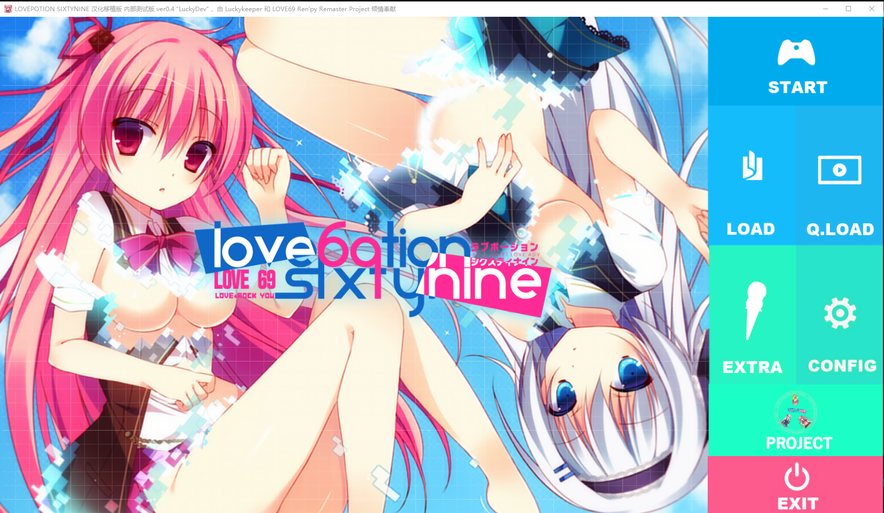

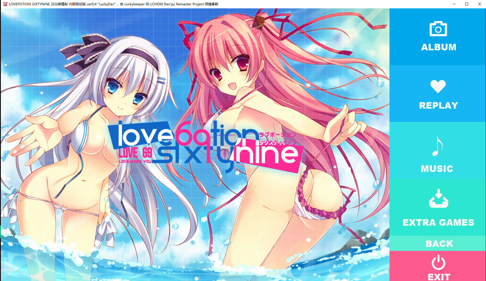

**Windows**

Demo版实机开发界面_主菜单

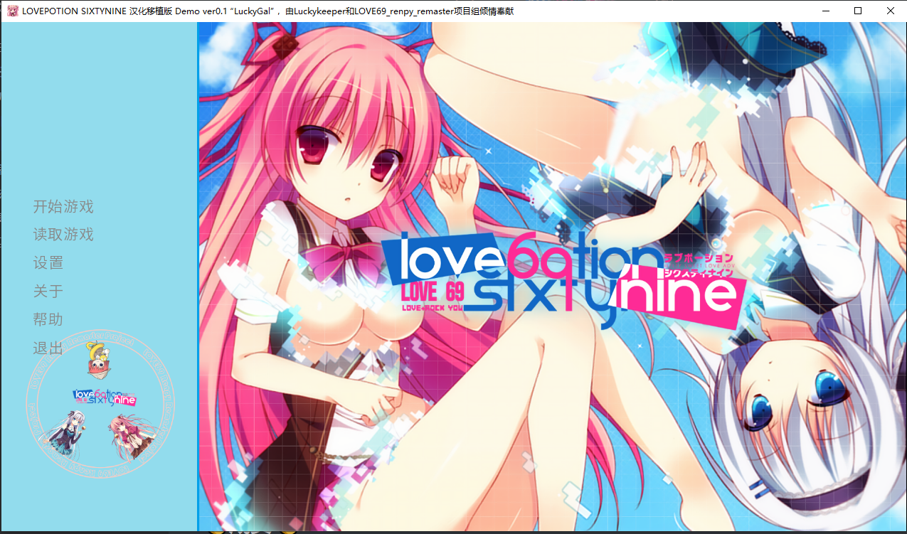

原对话框实现

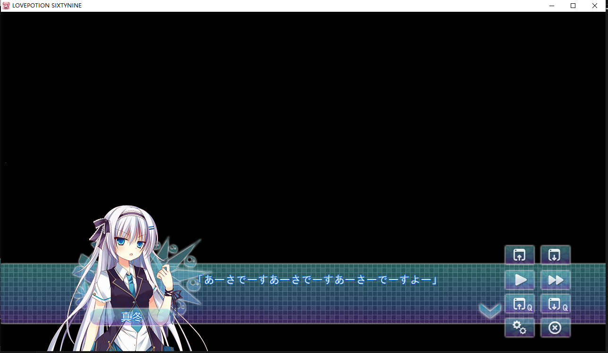

实机演示_Demo版对话框实现

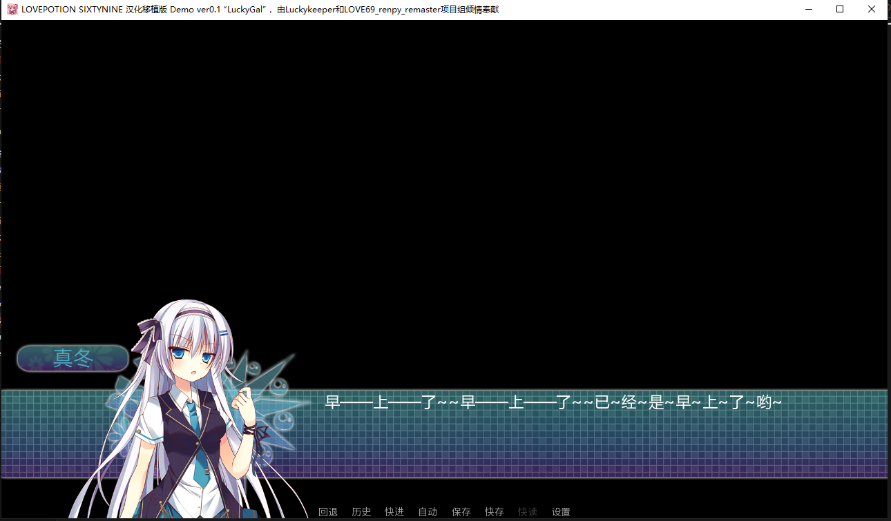

原带CG的主页面

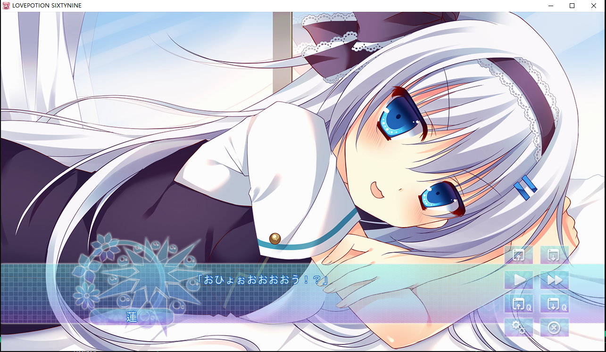

实机演示_Demo版带CG的主页面（waifu2x 720p->1080p）

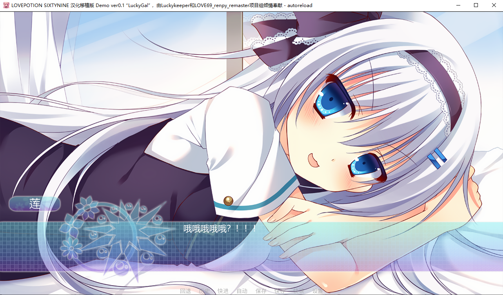

Demo版实机测试_GIF图

**Android**

测试设备：中兴Axon 30 Ultra 5G / Android 11 / MyOS 11.0.22MR_A2022P

初步确认可运行于新旧安卓手机、X86安卓设备、模拟器及Chrome Book

安卓Demo实机运行页面_安装

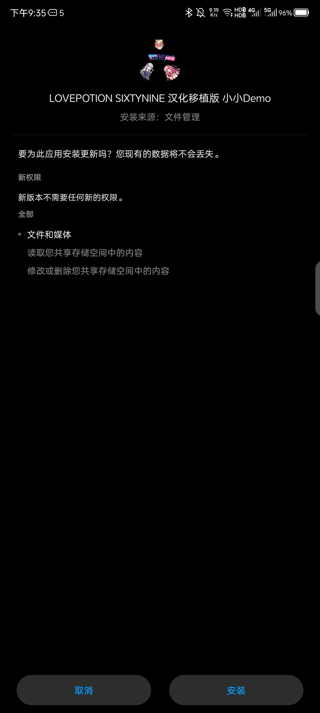

安卓Demo实机运行页面_项目组logo

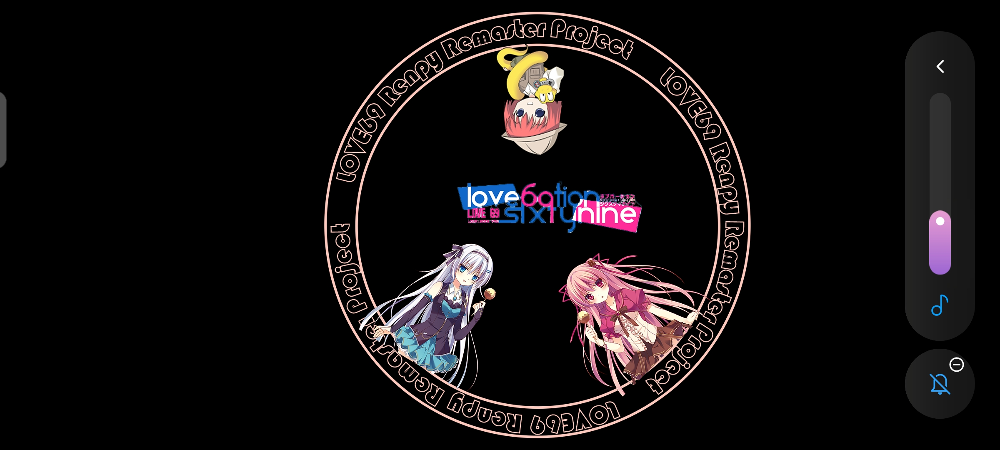

安卓Demo实机运行页面_主菜单

安卓Demo实机运行页面_对话框实现

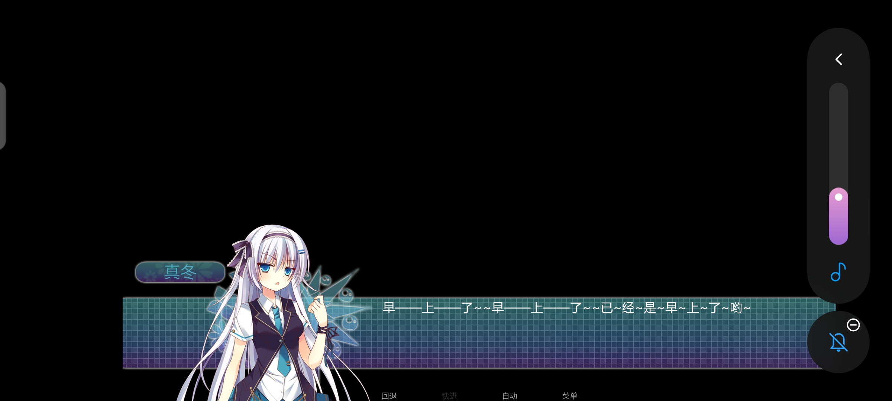

安卓Demo实机运行页面_带CG的主页面

**Linux**

Ubuntu Demo版实机运行页面

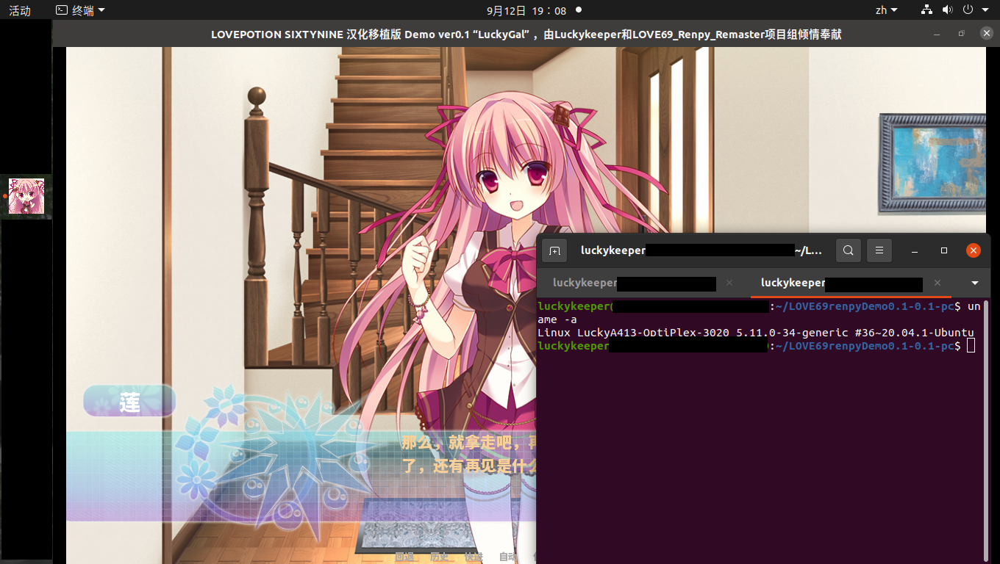

**MacOS**

MacOS_Demo实机运行页面_主菜单

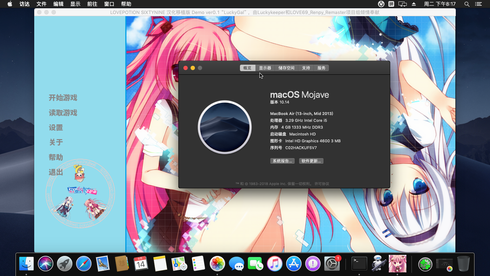

MacOS_Demo实机运行页面_对话框

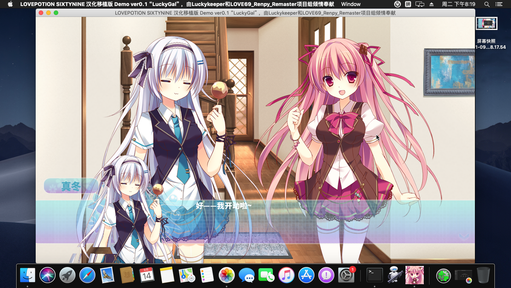

**WEB版**

​	WEB页面已经上传了，想尝鲜的话可以前往 [WEB版_Demo服务器](https://love69demo.luckykeeper.site/)（服务器在莫斯科，推荐在北京时间早上这样的低峰期访问，其它时段可能会遇到无法访问，速度缓慢等问题）

​	需要注意的是，WEB版是 Ren'Py 的实验性功能，实际体验并不是很好，很多音声、音效等等都不能正常加载，如果遇到页面/人物马赛克，这是因为对应的资源还没下载下来，可以通过反复按鼠标右键来让它重新加载，另外，WEB版与其它版本的内容并不同步，当前的WEB版更新时间为：2021年10月15日

​	最佳适配浏览器：Edge最新版，最新版Chrome兼容性稍差，其它浏览器不保证正常工作

​	有条件的话还是去玩电脑/手机版吧~

WEB版 Demo实机运行页面

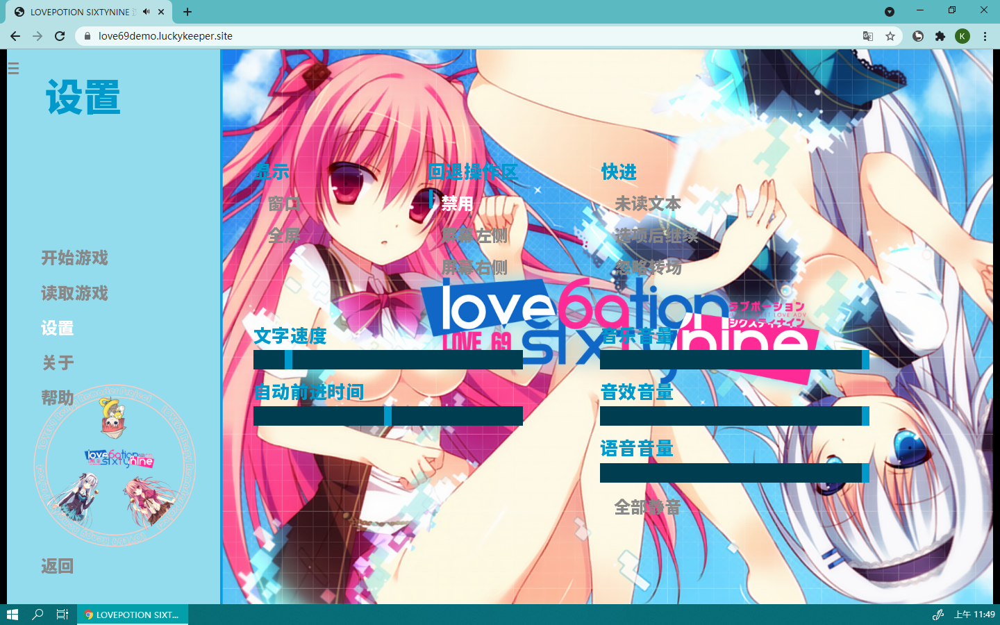

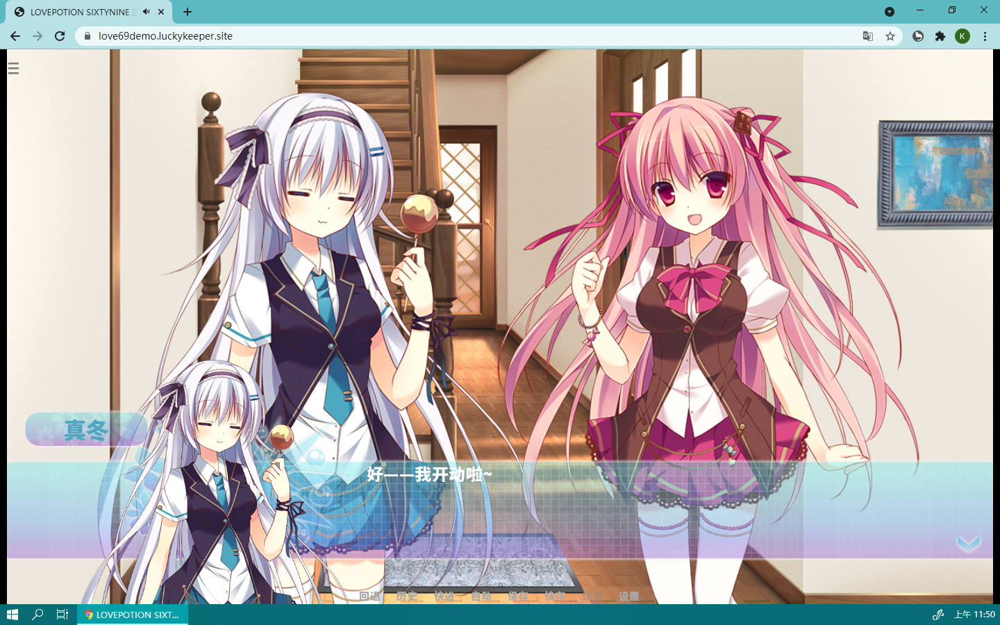

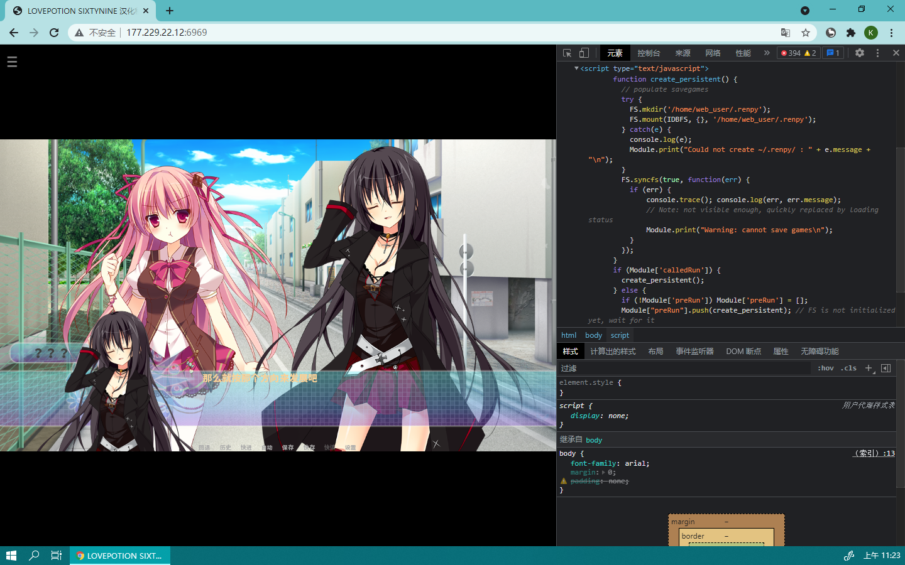

# 贡献及源码食用指北

[返回导航](#导航)

欢迎您前来让本项目变的更好&学习，下面简单介绍一下如何康~~本项目的代码~~我的胡言乱语

（Luckykeeper:第一次参与汉化工作，日语渣渣，主催&程序&美工&翻译&校对&润色&项目组网站基本上都是我一个人包的，测试也有参与，狂肝不易，还望轻喷😅）

讨论、聊天、提问、凑热闹、翻译纠正、提改进建议等……请移步 Issues ：[看已有条目](https://github.com/luckykeeper/LOVE69_renpy_remaster/issues) ； [发新贴](https://github.com/luckykeeper/LOVE69_renpy_remaster/issues/new)

那么，就赶快来介绍一下吧~

目前本项目的目录结构非常简单，`images` 文件夹下是本页展示的图片，`已完成的文档` 是程序的脚本，里面有如下文件（后面还会增加文件，但是没有新增的形式了）：

>已完成的文档
>
>│  OP歌词及翻译.md ——（OP的歌词整理及翻译，OP还没做）
>
>│
>
>├─bgm定义 ——（.rpy 都是 Ren'Py 的文件，别担心，语法非常简单，一看就懂）
>
>│      bgm.rpy
>
>│
>
>├─人物表——（定义出场人物的显示名称和立绘）
>
>│      character.rpy
>
>│
>
>├─剧本（脚本) ——（包含了文本以及控制脚本，也就是 Gal 的核心)
>
>│      scene01.rpy ——（Scene01 也就是第一幕，02就代表第二幕，以此类推）
>
>│      scene02.rpy —— （Scene01 大部分是共通线，02-15是一周目内容，16及后面是二周目内容）
>
>│      scene03.rpy
>
>│      scene04.rpy
>
>│      scene05.rpy
>
>│      scene06.rpy
>
>│      scene07.rpy
>
>│      scene08.rpy
>
>│      scene09.rpy
>
>│      scene10.rpy
>
>│      scene11.rpy
>
>│      scene12.rpy
>
>│      scene13.rpy
>
>│      scene14.rpy
>
>│      scene15.rpy
>
>│      script.rpy ——（主脚本，点击“开始游戏”之后程序的入口)
>
>│
>
>├─用户图形界面 ——（关于程序的用户界面都是在这里设定的）
>
>│      gui.rpy ——（开场动画设定脚本，打开程序)
>
>│      LOVE69_renpy_remaster_project.rpy ——（设定刚打开程序时的行为)
>
>│      options.rpy ——（关于页面，程序名称、标题，以及打包设置)
>
>│      screens.rpy ——（对话框和小人物头像的设置)
>
>│
>
>└─视频ass文件
>
>  CM with Sub.ass ——（Scene01中出现的电视CM的字幕文件)
>  

# 开源声明

[返回导航](#导航)

由于一些原因，本项目没有选择一般的开源协议，这并不代表您可以随意使用本项目的源码去做任何事，请您务必遵守这里以及Release里面的使用协议及说明，其中，**最重要的一条是本项目的所有内容禁止用于商业化，如果您使用了本项目的任何代码和脚本进行二次创作则必须对其开源，且必须在开源页面标注使用了本项目并标注本项目的 GitHub 地址**

下面是本项目开源协议的内容：

1. 本项目的所有内容，禁止用于商业化，如果您使用了本项目的任何代码和脚本进行二次创作则必须对其开源，且必须在开源页面标注使用了本项目并标注本项目的 GitHub 地址
2. 使用项目中[“已完成的文档”](https://github.com/luckykeeper/LOVE69_renpy_remaster/tree/main/%E5%B7%B2%E5%AE%8C%E6%88%90%E7%9A%84%E6%96%87%E6%A1%A3)目录下的任何内容进行二次开发必须先在`issues`内申请，申请时请说明你是谁、以及使用该项目的哪些内容，加上使用内容的目的，得到授权方可按照条件合理合法使用（条件参考但并不限于“开源声明”内容）
3. 使用[“已完成的文档”](https://github.com/luckykeeper/LOVE69_renpy_remaster/tree/main/%E5%B7%B2%E5%AE%8C%E6%88%90%E7%9A%84%E6%96%87%E6%A1%A3)目录下的任何内容须标明本项目的url和本人的名字（Luckykeeper）
4. 若程序使用了[“已完成的文档”](https://github.com/luckykeeper/LOVE69_renpy_remaster/tree/main/%E5%B7%B2%E5%AE%8C%E6%88%90%E7%9A%84%E6%96%87%E6%A1%A3)目录下的任何内容，则禁止擅自在一切视频网站（如：B站、Youtube等）上进行游戏的录播和直播
5. 请务必遵守您所在国家/地区的相关法律法规
6. 支持开源精神，鼓励用爱发电，欢迎大家参考本项目为自己喜欢的ADV/AVG进行汉化移植，如果该项目帮助了你，希望你在发布程序的时候提及一下这个项目的url和我
7. 如果该项目帮助了你，请帮我点亮一下页面上方的 `star` 这是对我最好的鼓励
8. 本项目不接受任何形式的捐赠，~~本页面是唯一指定的联系方式~~（L:项目组网站肝完了，链接在上面的表格里面，去那边也可以，那边评论不需要GitHub账号，没有GitHub账号的阔以去那边），想找我就发issues，看到会及时回复

# 其它事项

[返回导航](#导航)

- 出于各种原因，本次汉化移植并不会对“ghs”的内容（即 Hscene ）进行汉化和移植，各位绅士还请谅解，请积极考虑[购买正版](https://www.dlsite.com/maniax/work/=/product_id/RJ124813.html)支持原作团队

- 本页面最后修改时间 2023年10月26日

- 本页是 V2 版的 Readme ，第一版 Readme 考古戳[这里](./README_old.md)

- 项目组联系邮箱：love69renpyremasterproject@luckykeeper.site （邮箱有可能会炸，建议优先发Issues）

- 欢迎来围观本人开源项目，求 Star~

  > 【本项目相关】
  >
  > https://github.com/love69renpyremasterproject/love69renpyremasterproject.github.io <- 本项目的网站
  >
  > https://github.com/LOVE69-Renpy-Remaster-Project/EatCocoa <- 项目组给带伙准备的小游戏，[戳这里去玩](https://eatcocoa.luckykeeper.site:44443/)，请使用Edge、Chrome等主流浏览器，手机和电脑均可~~，欢迎大家来卷(doge)~~
  >
  > https://github.com/LOVE69-Renpy-Remaster-Project/Doc <- 正在施工的项目文档
  >
  > 【其它项目】
  >
  > https://github.com/luckykeeper/docker_plumemo <-个人博客的容器镜像

# Stargazers over time 

[返回导航](#导航)

**GitHub**

 
